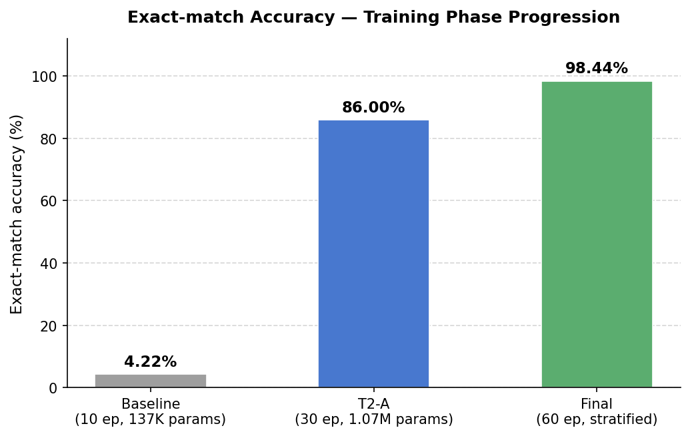
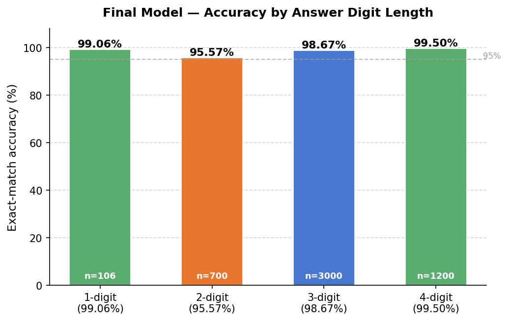
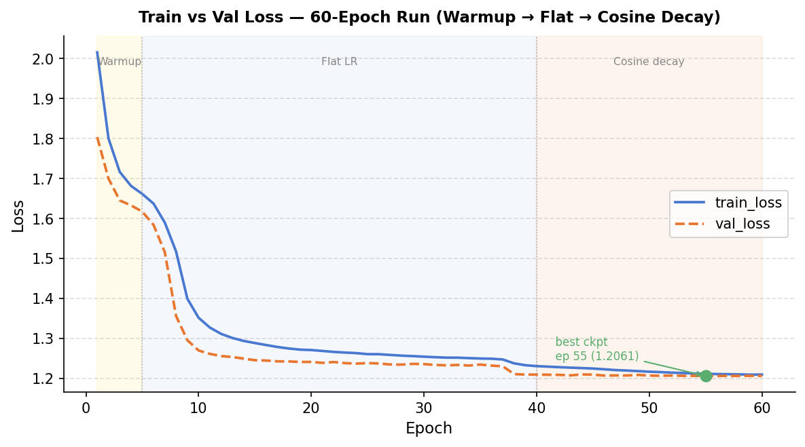

# Math-LLM-PoC

## 1. Project Overview

A proof-of-concept pipeline for training and serving a small decoder-only
Transformer that performs integer arithmetic from scratch. The system covers
the full ML lifecycle: synthetic data generation, supervised fine-tuning,
offline evaluation, and REST inference. Built using only PyTorch, FastAPI, and the
Python standard library. Every stage runs on CPU and is independently
executable from a clean clone.

### Results

| Metric | Value |
|---|---|
| Exact-match accuracy | **98.44%** |
| Addition accuracy | **98.96%** |
| Subtraction accuracy | **97.92%** |
| Hallucination rate | **0.00%** |
| Infinite generation | **0.00%** |
| Out-of-range predictions | **0.00%** |

---

## 2. Repository Structure

```
math-llm-poc/
├── artifacts/
│   ├── model.pt               # Trained model state_dict (4.1 MB, 1.07M params)
│   └── training_logs.txt      # Epoch-level loss, accuracy, and LR log (60 epochs)
├── data/
│   ├── train.csv              # ~40,000 training equations (stratified by answer length)
│   ├── val.csv                # ~5,000 validation equations
│   └── test.csv               # ~5,000 held-out test equations
├── docs/
│   ├── system_design.md       # Architecture, SFT/RL design, metrics, drift strategy
│   ├── audit_report.md        # Full improvement history and compliance tables
│   ├── accuracy_phases.png    # Bar chart: accuracy across training phases
│   ├── accuracy_by_length.png # Bar chart: accuracy by answer digit length
│   └── loss_curve.png         # Line chart: train/val loss over 60 epochs
├── src/
│   ├── generate_dataset.py    # Synthetic dataset generator (stratified sampling)
│   ├── tokenizer.py           # Character-level tokenizer (vocab size 16)
│   ├── model.py               # TinyDecoderLM: decoder-only Transformer definition
│   ├── train.py               # SFT training loop with AdamW and checkpoint saving
│   ├── evaluate.py            # Greedy decoding, exact-match accuracy, hallucination report
│   └── api.py                 # FastAPI server: /health and /predict endpoints
├── tools/
│   └── plot_metrics.py        # Generates the three charts under docs/
├── Dockerfile                 # Single-stage CPU-only inference image
├── requirements.txt           # Pinned dependencies (CPU torch wheel)
├── .dockerignore              # Excludes data/, logs, caches from image
├── .gitignore                 # Python + ML defaults
└── README.md
```

---

## 3. Quick Verification

The trained checkpoint is committed. No retraining is required to verify the results.

```bash
# 1. Evaluate the committed model against the held-out test set (~30 seconds on CPU)
python src/evaluate.py

# 2. Start the REST API locally and query it
uvicorn src.api:app --port 8000
curl -s -X POST http://localhost:8000/predict \
  -H "Content-Type: application/json" \
  -d '{"equation": "951+11="}' | python -m json.tool

# 3. Build and run the Docker image (requires Docker Desktop)
docker build -t math-llm . && docker run --rm -p 8000:8000 math-llm
```

---

## 4. Setup (Full Reproduction)

```bash
python -m venv .venv
source .venv/bin/activate          # Windows: .venv\Scripts\activate
pip install -r requirements.txt
```

> **Note:** `requirements.txt` pulls the CPU-only PyTorch wheel (~200 MB) from
> `download.pytorch.org/whl/cpu`. Installation takes 2–3 minutes on a fresh
> environment.

---

## 5. Usage

Run all commands from the repository root.

### a. Generate dataset

```bash
python src/generate_dataset.py
```

Writes `data/train.csv`, `data/val.csv`, and `data/test.csv`. The generator
uses stratified sampling by answer digit length so that short answers
(1- and 2-digit) are well represented in training — a critical fix for
small-number accuracy. Dataset is balanced 50/50 across `+` and `-`,
deterministic at seed 42.

### b. Train

```bash
python src/train.py
```

Trains for up to 60 epochs on `data/train.csv`, validates each epoch against
`data/val.csv`, and saves the best checkpoint to `artifacts/model.pt`.
The LR schedule uses a 5-epoch linear warmup (1e-4 → 1e-3), a flat phase
through epoch 40, then cosine decay to 1e-5. Early stopping (patience=8)
restores the best checkpoint before writing the final artifact. Expected
runtime: ~25–30 minutes on CPU. Example log:

```
epoch  train_loss  val_loss  val_token_acc          lr
------------------------------------------------------
    1      2.0156    1.8037         0.3065    1.00e-04
    5      1.6614    1.6171         0.3696    1.00e-03
   10      1.3515    1.2696         0.5035    1.00e-03
   40      1.2306    1.2094         0.5239    1.00e-03
   55      1.2114    1.2061         0.5254    1.55e-04
   60      1.2095    1.2062         0.5253    1.00e-05
```

### c. Evaluate

```bash
python src/evaluate.py
```

Runs greedy decoding over `data/test.csv` and prints a report covering
exact-match accuracy (overall and per-operation), hallucination rate,
infinite-generation rate, and out-of-range predictions.

Current results on the 5,006-sample test set:

```
exact_match_accuracy  : 0.9844  (4928 / 5006)
[+] exact_match       : 0.9896  (2480 / 2506)
[-] exact_match       : 0.9792  (2448 / 2500)
hallucinations        : 0.0000  (   0 / 5006)
infinite_generation   : 0.0000  (   0 / 5006)
out_of_range          : 0.0000  (   0 / 5006)
```

Accuracy by answer digit length:

| Answer length | Accuracy |
|---|---|
| 1-digit | 99.06% (105/106) |
| 2-digit | 95.57% (669/700) |
| 3-digit | 98.67% (2960/3000) |
| 4-digit | 99.50% (1194/1200) |

### Visual Summary

Three charts are committed under `docs/` and generated by `tools/plot_metrics.py`.

**Accuracy progression across training phases** — shows the jump from 4.22% (baseline)
to 86.00% (T2-A) to 98.44% (final model with stratified data and LR schedule).



**Accuracy by answer digit length** — breaks down the final model's exact-match rate
for 1-, 2-, 3-, and 4-digit answers, demonstrating that the stratified dataset
eliminated the previous near-zero performance on short answers.



**Train vs val loss — 60-epoch run** — full loss curve with LR phase shading
(warmup / flat / cosine decay) and the best-checkpoint marker at epoch 55.



### d. Run API locally

```bash
uvicorn src.api:app --host 0.0.0.0 --port 8000
```

The server loads `artifacts/model.pt` at startup. Visit
`http://localhost:8000/docs` for the auto-generated OpenAPI UI.

---

## 6. Docker

### Build

```bash
docker build -t math-llm .
```

> Requires `artifacts/model.pt` to exist (run `train.py` first).

### Run

```bash
docker run --rm -p 8000:8000 math-llm
```

---

## 7. API Reference

### `GET /health`

Returns server and model status.

```bash
curl http://localhost:8000/health
```

```json
{
  "status": "ok",
  "model_loaded": true
}
```

### `POST /predict`

Accepts an arithmetic equation (must end with `=`) and returns the model's
predicted answer.

**Request body**

| Field    | Type   | Constraint                        |
|----------|--------|-----------------------------------|
| equation | string | Matches `^\d{1,3}[+-]\d{1,3}=$`  |

```bash
curl -X POST http://localhost:8000/predict \
  -H "Content-Type: application/json" \
  -d '{"equation": "951+11="}'
```

**Response**

```json
{
  "equation": "951+11=",
  "predicted_answer": "962",
  "full_output": "951+11=962",
  "latency_ms": 36.82
}
```

**Error responses**

| Status | Cause |
|--------|-------|
| 422    | Equation fails regex validation (wrong format, 4-digit operand, missing `=`) |
| 503    | Model checkpoint failed to load at startup |

---

## 8. Engineering Assumptions

- **Operand range is fixed at [0, 999].** The model is not expected to
  generalise to larger numbers; out-of-range inputs are rejected at the API
  boundary by the Pydantic validator.
- **Subtraction results are non-negative.** The dataset enforces `op1 ≥ op2`,
  keeping the answer vocabulary purely numeric and avoiding a sign token.
- **Character-level tokenisation is sufficient.** With a vocabulary of 16
  tokens (digits, operators, `=`, three specials), a subword tokeniser adds
  complexity without benefit for this fixed domain.
- **CPU-only training and inference.** The model (1.07M parameters) trains in
  ~25–30 minutes on a modern laptop CPU and serves requests in ~35 ms.
- **The model checkpoint is committed to the repository.** This allows
  `docker build` to run without a training step and keeps the artefact
  co-located with the code for assessment purposes. In production, the
  checkpoint would live in a model registry.
- **No authentication or rate limiting on the API.** The server is intended
  for local and container-internal use. Adding an API key header or a reverse
  proxy is the first hardening step before any public exposure.
- **Greedy decoding is the only inference strategy.** Beam search or
  temperature sampling would add complexity for no measurable gain on a
  deterministic arithmetic task.
- **`max_new_tokens=8` is sufficient for all valid answers.** The longest
  possible answer is `1998` (4 digits + `<EOS>` = 5 tokens), leaving 3 tokens
  of headroom.

---

## 9. Known Limitations

- **No generalisation beyond training range.** Operands outside [0, 999] are
  rejected at the API level; operands inside the range but rare in training
  (e.g., boundary values) may produce incorrect answers.
- **Carry/borrow cascade edge cases.** The model still fails on certain
  multi-step carry/borrow patterns such as `99+1=100` and `100-99=1`. These
  require consecutive digit-position interactions that are rare in the training
  distribution; targeted oversampling of these patterns or increased model
  capacity would reduce the remaining gap.
- **No RLHF or outcome-supervised training.** The model is SFT-only. Errors
  are not penalised beyond next-token loss, so the model can generate plausible
  but wrong sequences with high confidence.
- **Sequential inference.** The API handles one request at a time on a single
  CPU thread. Concurrent requests queue behind the GIL and the synchronous
  FastAPI route handler.
- **No model versioning.** `artifacts/model.pt` is overwritten on each
  training run. Retraining without branching destroys the previous checkpoint.

---

## 10. Future Improvements

- **Hard-case oversampling.** Explicitly oversample carry/borrow cascade
  patterns (e.g., `X9+1`, `X00-X99`) in the training dataset to close the
  remaining accuracy gap on those edge cases.
- **GRPO/PPO fine-tuning.** Add an RL stage after SFT using a rule-based
  verifier (exact-match reward) to optimise for answer correctness rather than
  token likelihood. See `docs/system_design.md` § 5 for the plug-in design.
- **Extend to multiplication and division.** Requires adding `*` and `/`
  tokens to the vocabulary and regenerating the dataset; the model architecture
  and training loop are unchanged.
- **Beam search decoding.** A width-2 or width-4 beam would improve accuracy
  on remaining carry positions at negligible latency cost at this model size.
- **Async FastAPI routes + request batching.** Replace the synchronous route
  handler with `async def` and a batching queue to serve concurrent requests
  efficiently.
- **Model registry integration.** Replace the committed checkpoint with a
  versioned artefact store (MLflow, W&B, or S3 + DVC) so training runs are
  tracked and rollback is possible.
- **Structured JSON logging.** Emit per-request logs as JSON to stdout so a
  log aggregator can compute rolling latency percentiles, hallucination rates,
  and answer-distribution histograms without code changes.
