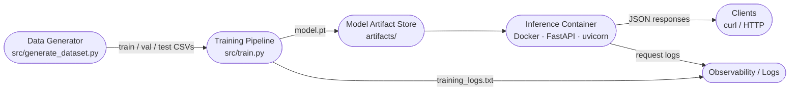
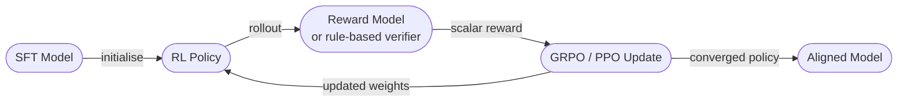

# System Design — Math-LLM-PoC

## 1. Overview

This system is a proof-of-concept pipeline for training and serving a small
decoder-only Transformer that performs integer arithmetic. It covers the full
ML lifecycle: synthetic dataset generation, supervised fine-tuning (SFT),
offline evaluation, and REST inference packaged in a single Docker container.
The design prioritises simplicity and reproducibility over scale — every stage
runs on CPU with no external ML framework beyond PyTorch, and each script is
independently executable from a clean clone.

---

## 2. System Architecture

---

## 3. Component Descriptions

### Data Generator — `src/generate_dataset.py`
Produces 50,000 deduplicated arithmetic equations (addition and subtraction,
operands 0–999) and writes stratified 80/10/10 train/val/test CSVs to `data/`.
Deduplication is set-based on the `(op1, operator, op2)` triple; subtraction
enforces `op1 ≥ op2` to keep all answers non-negative. A fixed random seed
(42) makes the split fully reproducible.

### Training Pipeline — `src/train.py`
Loads the CSVs into a `torch.utils.data.Dataset`, encodes each equation as a
`<BOS> … <EOS>` character sequence, and trains `TinyDecoderLM` with
next-token cross-entropy loss (padding positions masked). Optimiser: AdamW
with gradient clipping. Validation loss and token accuracy are reported each
epoch. The best checkpoint is saved to `artifacts/model.pt`.

### Model Artifact Store — `artifacts/`
A plain directory committed to the repository. Contains:
- `model.pt` — `state_dict` of the trained `TinyDecoderLM`
- `training_logs.txt` — epoch-level metrics (loss, token accuracy)

In a production system this directory would be replaced by a model registry
(MLflow, W&B Artifacts, S3 + DVC).

### Inference Container — `Dockerfile`
A single `python:3.11-slim` image that copies `src/` and `artifacts/model.pt`,
installs CPU-only PyTorch from the official wheel index, and starts
`uvicorn src.api:app`. The model and tokenizer are loaded once at startup via
FastAPI's lifespan context manager; per-request cost is a single forward pass
(~35 ms on CPU for sequences of length ≤ 16).

### Observability / Logging
Training emits structured epoch records to `artifacts/training_logs.txt`.
The inference API logs each request (equation, predicted answer, latency in ms)
to stdout, captured by the container runtime. For this PoC, no external
metrics sink is wired; in production the natural next step is structured JSON
logging consumed by a log aggregator (Loki, CloudWatch, Datadog).

---

## 4. SFT in This System

Supervised Fine-Tuning (SFT) is the only training stage. The model is trained
with teacher-forcing: at each position `t` the input is the ground-truth prefix
`seq[0:t]` and the target is `seq[t+1]`. This forces the model to learn both
the surface format (`digits operator digits =`) and the arithmetic mapping
(`= answer <EOS>`).

SFT converges quickly on this narrow domain because the task distribution is
fully controlled — there is no ambiguity, no noise, and no held-out concepts.
It is the appropriate and sufficient training objective for a PoC of this scope.

---

## 5. RL Extension — Where GRPO/PPO Would Plug In

In a production system a reinforcement-learning stage would follow SFT to
optimise for outcome quality rather than token-level likelihood:

**Reward signal for arithmetic:** a rule-based verifier (exact-match check)
is sufficient — no learned reward model is needed. The reward is `+1` if the
decoded answer equals the ground-truth integer, `0` otherwise.

**GRPO** (Group Relative Policy Optimisation) is preferred over PPO for this
task because it eliminates the value network, reducing memory and compute by
roughly half. GRPO samples a group of completions per prompt, computes their
relative advantage within the group, and clips the policy ratio — identical
surgery to PPO but without a separate critic.

The RL loop would be inserted between `train.py` (SFT) and `evaluate.py`,
reading the SFT checkpoint as the starting policy and writing a refined
checkpoint back to `artifacts/model.pt`.

---

## 6. Docker Architecture

### Why one container?

Training and inference have different dependency footprints in production, but
for a PoC the simplest deployable unit is a single image that carries the
pre-trained checkpoint. Splitting into separate train and serve images would
add orchestration complexity (volume mounts, image tagging pipelines) with no
benefit at this scale.

### Training vs inference separation

| Concern | Training | Inference |
|---|---|---|
| Entry point | `python3 src/train.py` (local) | `uvicorn src.api:app` (container) |
| Data | `data/*.csv` mounted or local | Not needed — excluded by `.dockerignore` |
| Output | `artifacts/model.pt` written locally | `artifacts/model.pt` baked into image |
| Hardware | CPU (this PoC); GPU-capable with env var | CPU only |

The Dockerfile does not run training. The checkpoint is produced locally, then
`COPY`'d into the image at build time. This keeps image builds fast (no
training step in CI) and the image fully self-contained.

---

## 7. Metrics

### Offline (computed at evaluation time)

| Metric | Definition | Tool |
|---|---|---|
| Cross-entropy loss | Mean next-token NLL over non-padded positions | `src/train.py` (val), `src/evaluate.py` |
| Token accuracy | Fraction of non-padded tokens predicted correctly | `src/train.py` (val) |
| Exact-match accuracy | Full decoded answer == ground-truth string | `src/evaluate.py` |
| Hallucination rate | Fraction of outputs with non-digit or empty answer | `src/evaluate.py` |
| Infinite-generation rate | Fraction of outputs that hit `max_new_tokens` without `<EOS>` | `src/evaluate.py` |

### Online (computed at serving time)

| Metric | Definition | Signal |
|---|---|---|
| Request latency (p50/p99) | `time.perf_counter()` around `greedy_generate` | Performance regression |
| Hallucination rate | Non-digit answer chars in production traffic | Model quality |
| Answer distribution | Histogram of predicted integer values | Distribution shift |
| Out-of-range rate | Predicted integer > 1998 | Input drift |

---

## 8. Data Drift

### Definition
Data drift occurs when the distribution of incoming equations at inference time
diverges from the training distribution. For this system the relevant axes are:

- **Operand magnitude** — training covers [0, 999]; requests with larger
  operands fall outside the learned distribution.
- **Operation imbalance** — the training set is 50 % addition / 50 %
  subtraction; a production workload skewed toward one operator may expose
  gaps in the other.
- **Digit-length bias** — three-digit operands dominate the training set by
  probability; a user population sending mostly single-digit queries may see
  artificially high accuracy that masks poor generalisation.

### Detection strategy

1. **Input-level checks (synchronous):** the Pydantic regex `^\d{1,3}[+\-]\d{1,3}=$`
   rejects out-of-vocabulary inputs at the API boundary before they reach the
   model. Out-of-range rejections are counted and surfaced via `/health` or logs.

2. **Output-level monitoring (async):** log predicted answers to a sink and
   compute a rolling hallucination rate and answer-value histogram. A spike in
   hallucinations or a shift in the answer distribution (e.g., mean predicted
   answer drifting toward extremes) is an early signal of distributional
   mismatch.

3. **Periodic offline re-evaluation:** re-run `src/evaluate.py` against a
   freshly sampled test set drawn from recent traffic. A drop in exact-match
   accuracy of more than a chosen threshold (e.g., 5 pp) triggers retraining.
